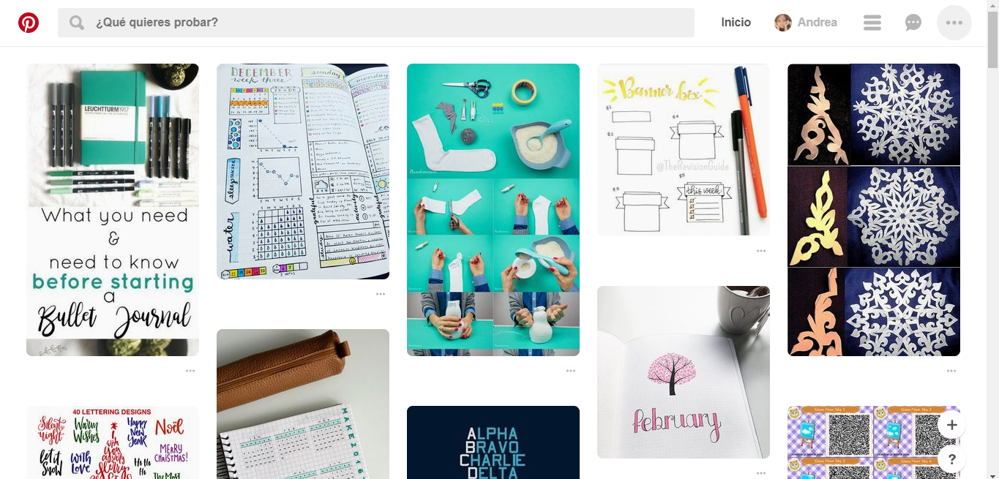
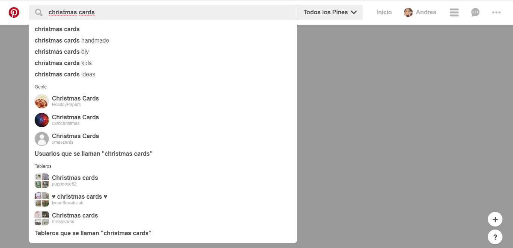
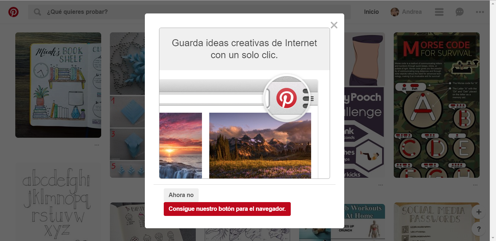
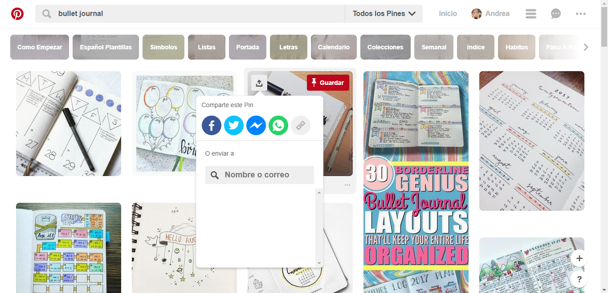
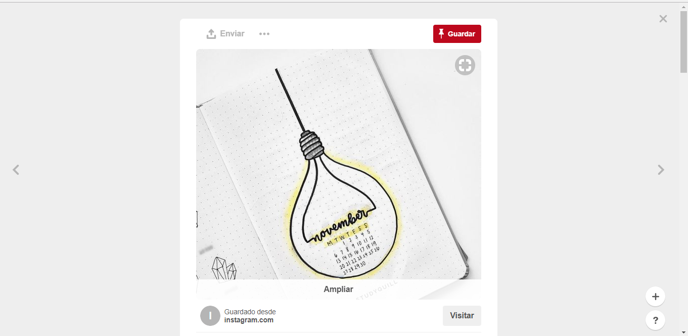

## UX & UI

#### Objetivo:
Identificar las partes que conforman la experiencia de usuario (UX) y la interfaz de usuario (UI) de una página web de nuestra preferencia. En este caso, hemos elegido __Pinterest__.

  

Partes UX | Partes UI
-- | --
Una barra de navegación fija nos permite acceder rápidamente al buscador, nuestro perfil, notificaciones y otras herramientas. | Predominan los colores de fondo blanco y humo en todas las vistas de la website. Esta simplicidad encuentra color en todas las imágenes mostradas.
Al inicio, el buscador muestra las búsquedas más recientes; y luego de ingresar una palabra o frase, muestra recomendaciones que contienen lo que ingresamos. | Color rojo del logo y diseño de los botones y barras.
Las imágenes se muestran sin ningún texto de referencia que ocupe espacio innecesario; solo cuando hacemos hover sobre alguna, cambia su opacidad y se muestran los botones para compartirla (a diferentes redes sociales) o guardarla.  | El fondo de las etiquetas relacionadas con nuestra búsqueda es muy original ya que no es un color entero, sino otras imágenes opacadas que no cubren el texto de las etiquetas.
La organización predefinida nos permite buscar imágenes por categorías y guardarlas en tableros personalizados por nosotros mismos. | La tipografía y los iconos de la website.
No solo podemos compartir y guardar las imágenes que buscamos, sino que también podemos subir las nuestras. | Los bordes de todos los botones e imágenes son redondeados.
Podemos invitar a otras personas a que colaboren con nuestros tableros y a la vez nosotros también podemos ser colaboradores. | Al hacer hover sobre cualquier botón siempre cambian a un color más oscuro.

#### Capturas de pantalla referenciales

